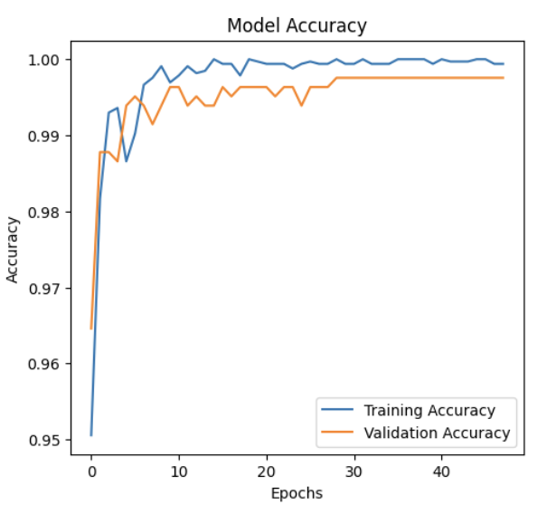
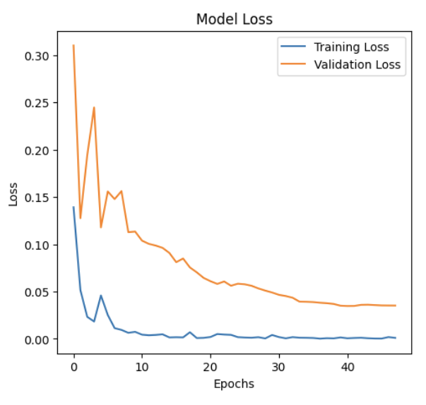

# FACE DETECTION
This project focuses on the classification and segmentation of face masks in images. The following techniques have been employed:

* Machine Learning Classifiers: Random Forest, SVM, and Neural Network
* Convolutional Neural Network (CNN): For effective image classification
* Segmentation Techniques: Traditional methods such as edge detection and thresholding
* U-Net Architecture: For precise mask segmentation
The methodology, along with detailed results and comparisons between traditional techniques and deep learning approaches, is thoroughly discussed.

**Contributors:**

* Siddeshwar Kagatikar (IMT2022026)
* Dikshant Mahawar (IMT2022549)
* Bhavya Kapadia (IMT2022095)

# DATASET

For classification tasks, the dataset used is: <a>https://github.com/chandrikadeb7/Face-Mask-Detection/tree/master/dataset</a>. It contains images of people with and without face masks.

For segmentation tasks, the dataset used is: <a>https://github.com/sadjadrz/MFSD</a>. It contains the ground truth face masks in the form of binary images.

# METHODOLOGY

## 1. Part A

#### The code is divided into 3 parts: Feature Extraction, Data Preprocessing and Machine Learning Classifier Training

## Feature Extraction

**Histogram of Oriented Gradients (HOG):** HOG extracts structural and gradient information, making it effective for detecting object shapes and edges. The image is first resized to 128×128, converted to grayscale, and then processed into gradient histograms using 9 orientations, 8×8 pixel cells, and 2×2 block normalization.  

**Local Binary Patterns (LBP):** LBP serves as a texture descriptor by analyzing neighboring pixel intensities to generate a binary pattern. Here, the grayscale image is transformed using an 8-point circular neighborhood LBP, and a histogram of these patterns is computed and normalized. This helps capture texture details, complementing HOG for improved classification.

## Data Preprocessing

The code preprocesses images by resizing them to 128×128 and converting them to grayscale for consistency. HOG extracts shape-based features, while LBP captures texture patterns. The extracted features are normalized using **StandardScaler** to ensure uniform distribution. The dataset is then split into **80% training and 20% testing** using **train-test split**, with **stratify** preserving class balance for better model performance. Hyperparameter tuning is done using GridSearch CV and RandomizedSearch CV.

## Training The Machine Learning Models

We have implemented two Machine Learning Classifiers and one Neural Network Classifier. The models are as follows:

#### Support Vector Machine Classifier -> Best Parameters: {'C': 10, 'kernel': 'rbf'}

#### Random Forest Classifier -> Best Parameters: {'max_depth': 27, 'min_samples_leaf': 5, 'min_samples_split': 3, 'n_estimators': 93}

#### Neural Network Classifier -> A fully connected neural network for binary classification with three hidden layers (64-64-32 neurons), ReLU activation, dropout for regularization, and a softmax output layer.

## 2. Part B
1. **Data Loading and Preprocessing**

* Image Size: 96x96 pixels

* Normalization: Each image is resized to 96x96 and normalized using the formula:

* Label Encoding: Labels are one-hot encoded using to_categorical().

* Data Augmentation: Applied transformations like rotation, width/height shift, shear, zoom, and horizontal flip using ImageDataGenerator to enhance model generalization.

2. **Model Definition (CNN)**

* Base Model: MobileNetV2 (pre-trained on ImageNet, with the top layer removed).

* Layer Configuration:

    * The last 30 layers of MobileNetV2 are set to trainable.

    * A Global Average Pooling layer is added for feature extraction.

    * A dense layer with 512 neurons and ReLU activation improves learning capacity.

    * Dropout (40%) is applied to reduce overfitting.

    * The output layer uses Softmax activation for binary classification (mask/no mask).

Optimizer: Adam optimizer with a learning rate of 0.0005.

Loss Function: Categorical Crossentropy.

Class Weights: Balanced to handle class imbalance effectively.

3. Training

The model is trained for 50 epochs with a batch size of 32.

Callbacks like EarlyStopping (patience=7) and ReduceLROnPlateau are used for better convergence.

Data augmentation enhances the dataset by introducing variability in image transformations.

4. Evaluation

Accuracy & Loss Graphs: Plotted for both training and validation data.

Confusion Matrix: Visualized to assess model performance.

Classification Report: Displays precision, recall, and F1-score for each class.

y_pred = np.argmax(model.predict(X_test), axis=1)
y_true = np.argmax(y_test, axis=1)

The evaluation metrics ensure the model's robustness and accuracy in identifying masked and unmasked individuals.

# HYPERPARAMETER TUNING

## 1. Part B
This face mask detection model includes several important hyperparameters and techniques that were adjusted to improve performance. The following key hyperparameters and experiments were conducted:

* **`IMG_SIZE`** 
    * Values Tested: 64, 96, 128
    * Best Value: 96 (Balanced performance between model complexity and accuracy).
* **`BATCH_SIZE`**  
    * Values Tested: 16, 32, 64
    * Best Value: 32 (Optimal balance between convergence speed and memory efficiency).
* **`LEARNING_RATE`**
    * Values Tested: 0.001, 0.0005, 0.0001
    * Best Value: 0.0005 (Improved convergence stability).
* **`EPOCHS`** 
    * Values Tested: 30, 50, 70
    * Best Value: 16 (Good balance between convergence and overfitting).
* **`Dropout Rate`**
    * Values Tested: 0.3, 0.4, 0.5,0.6,0.7
    * Best Value: 0.55 (Effectively reduced overfitting without sacrificing performance).
* **`Data Augmentation`**
    * Augmentation techniques tested:
        * Rotation Range: 10°, 15°, 20° → Best: 15°
        * Width/Height Shift Range: 0.05, 0.1, 0.2 → Best: 0.1
        * Shear Range: 0.05, 0.1, 0.2 → Best: 0.1
        * Zoom Range: 0.05, 0.1, 0.2 → Best: 0.1
        * Horizontal Flip: Enabled (Improved generalization).
* **`Class Weighting`**
    * Balanced class weighting significantly improved performance on imbalanced datasets.
* **`Base Model`** 
    * Layers unfrozen for fine-tuning:
        * Tested values: 20, 30, 40, 50, 60, 70, 80 layers unfrozen
        * Best Value: 60 layers unfrozen for optimal feature extraction.
* **`Optimizer`**
    * Values Tested: Adam, AdamW, RMSprop
    * Best Value: Adam with a learning rate of 0.0003.

# PROBLEM FACED

## 2. Part B

This graph illustrates the Training Accuracy and Validation Accuracy of our Convolutional Neural Network (CNN) model over multiple epochs.

### Accuracy Curve
* **`Early Phase (0-5 Epochs):`**
    *The model quickly learns basic patterns, showing a steep rise in both training and validation accuracy.

* **`Middle Phase (5-15 Epochs):`**
    * The training accuracy continues improving steadily.
    * The validation accuracy shows minor fluctuations, indicating the model is learning more complex features.
* **`Late Phase (15+ Epochs):`**
    * Training accuracy plateaus close to 100%, while validation accuracy stabilizes slightly lower.
    * This suggests potential overfitting, where the model memorizes the training data instead of generalizing effectively.

This graph represents the Training Loss and Validation Loss of our Convolutional Neural Network (CNN) model across multiple epochs.

### Loss Curve
* **`Early Phase (0-5 Epochs):`**
    * Both training and validation losses decrease rapidly, showing that the model is learning fundamental patterns effectively.
    * The initial spikes in validation loss indicate unstable learning in the early stages, which is common.
* **`Middle Phase (5-20 Epochs):`** 
    * The training loss continues to decline steadily.
    * The validation loss shows noticeable fluctuations but gradually decreases.
* **`Late Phase (20+ Epochs):`**
    * The training loss stabilizes near zero, while the validation loss plateaus at a higher value.
    * This growing gap suggests overfitting, where the model memorizes the training data rather than generalizing well to new data.

# RESULTS
## PART-A
### SVM

#### Classification Report

| Class | Precision | Recall | F1-Score | Support |
|-------|-----------|--------|----------|---------|
| **0** (Without Mask) | 0.95 | 0.93 | 0.94 | 386 |
| **1** (With Mask) | 0.94 | 0.96 | 0.95 | 433 |
| **Accuracy** |  |  | **0.95** | 819 |
| **Macro Avg** | 0.95 | 0.95 | 0.95 | 819 |
| **Weighted Avg** | 0.95 | 0.95 | 0.95 | 819 |

---

#### Confusion Matrix

| Actual \ Predicted | 0 | 1 |
|--------------------|----|----|
| **0 (Without Mask)** | 359 | 27 |
| **1 (With Mask)** | 17 | 416 |

### RANDOM FOREST CLASSIFIER

#### Classification Report

| Class | Precision | Recall | F1-Score | Support |
|-------|-----------|--------|----------|---------|
| **0** (Without Mask) | 0.96 | 0.85 | 0.90 | 386 |
| **1** (With Mask) | 0.88 | 0.97 | 0.92 | 433 |
| **Accuracy** |  |  | **0.91** | 819 |
| **Macro Avg** | 0.92 | 0.91 | 0.91 | 819 |
| **Weighted Avg** | 0.92 | 0.91 | 0.91 | 819 |

---

#### Confusion Matrix

| Actual \ Predicted | 0 | 1 |
|--------------------|----|----|
| **0 (Without Mask)** | 329 | 57 |
| **1 (With Mask)** | 15 | 418 |

### NEURAL NETWORK CLASSIFIER

#### Model Performance Metrics

| Metric          | Value  |
|----------------|--------|
| **Test Accuracy**  | 94.02% |
| **Test Precision** | 94.02% |
| **Test Recall**    | 94.02% |
| **Test AUC**       | 0.9712 |

## PART-B
**`Key Improvements to Control Overfitting: `**
    1. Enhanced data augmentation for better generalization.
    2. Increased dropout rates for stronger regularization.
    3. Added L2 regularization in dense layers.
    4. Reduced learning rate for stable convergence.
    5. Frozen more layers in MobileNetV2 to prevent overfitting on small datasets.
    6. Balanced the number of epochs with early stopping to prevent over-training.

