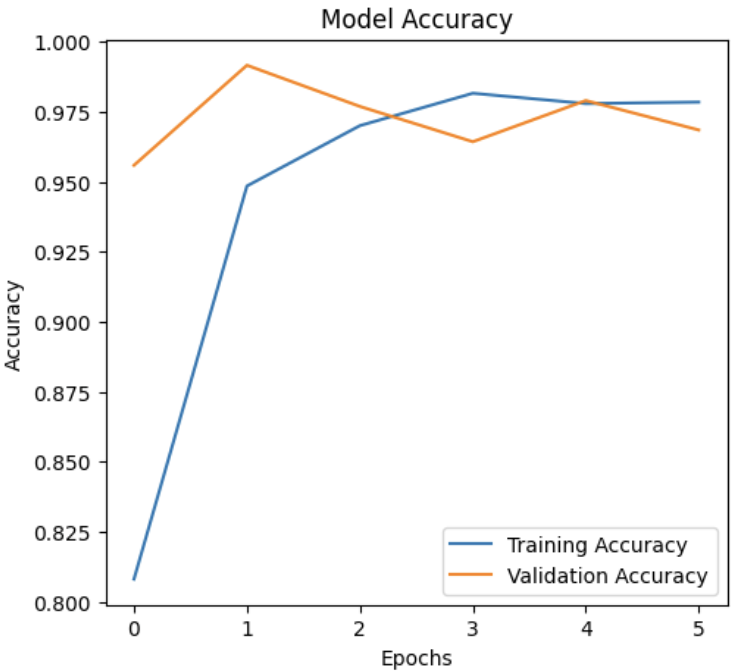
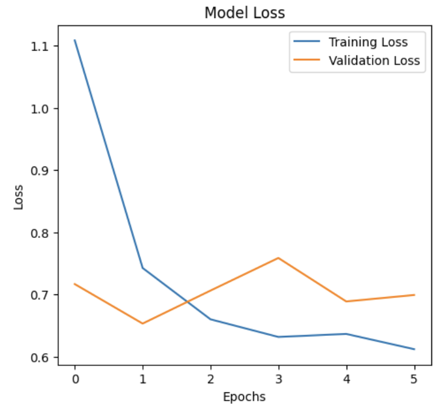
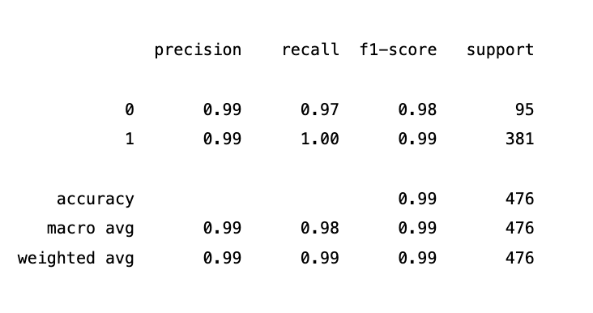
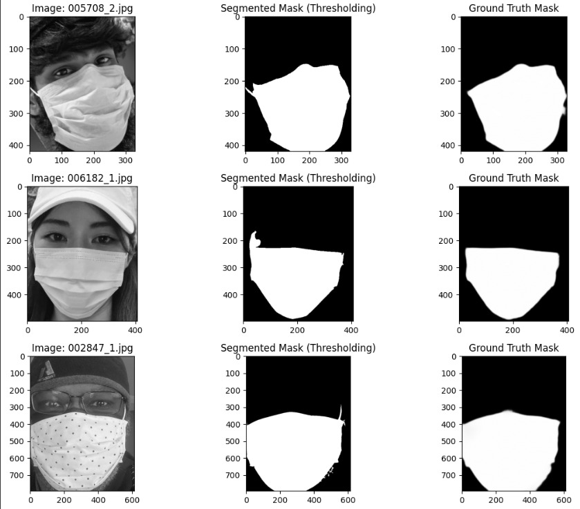
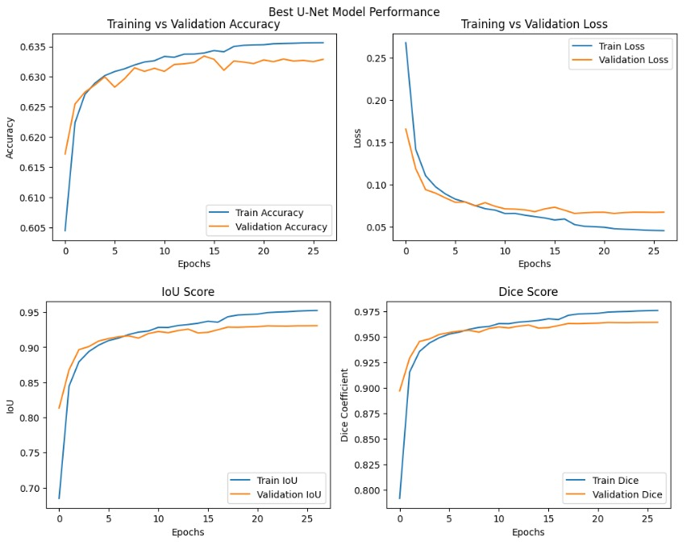
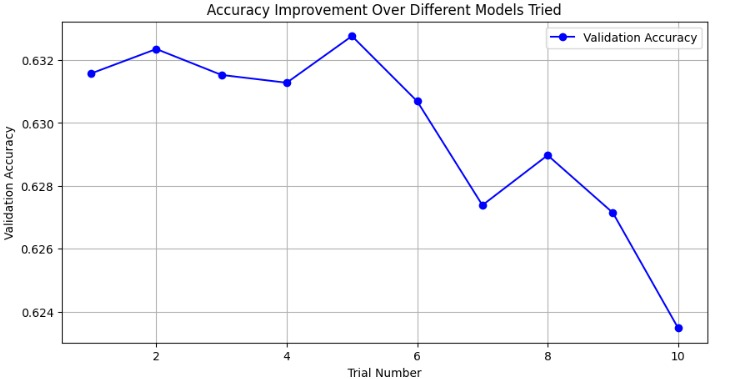
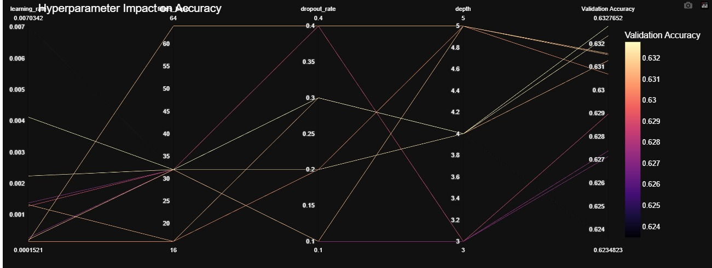
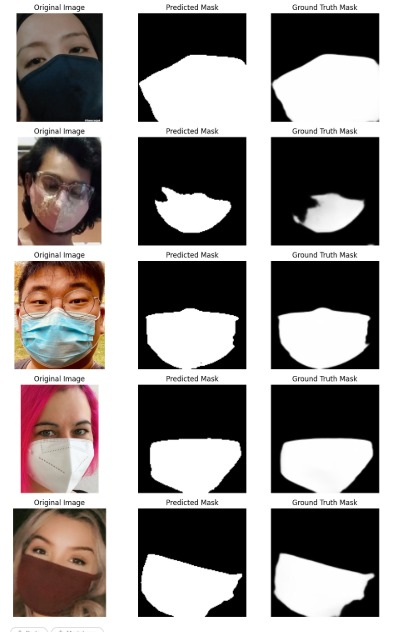

# FACE DETECTION
This project focuses on the classification and segmentation of face masks in images. The following techniques have been employed:

* Machine Learning Classifiers: Random Forest, SVM, and Neural Network
* Convolutional Neural Network (CNN): For effective image classification
* Segmentation Techniques: Traditional methods such as edge detection and thresholding
* U-Net Architecture: For precise mask segmentation
The methodology, along with detailed results and comparisons between traditional techniques and deep learning approaches, is thoroughly discussed.

**Contributors:**

* Siddeshwar Kagatikar (IMT2022026)
* Dikshant Mahawar (IMT2022549)
* Bhavya Kapadia (IMT2022095)

# DATASET

For classification tasks, the dataset used is: <a>https://github.com/chandrikadeb7/Face-Mask-Detection/tree/master/dataset</a>. It contains images of people with and without face masks.

For segmentation tasks, the dataset used is: <a>https://github.com/sadjadrz/MFSD</a>. It contains the ground truth face masks in the form of binary images.

# METHODOLOGY

## 1. Part A

#### The code is divided into 3 parts: Feature Extraction, Data Preprocessing and Machine Learning Classifier Training

1. **`Feature Extraction`**

**Histogram of Oriented Gradients (HOG):** HOG extracts structural and gradient information, making it effective for detecting object shapes and edges. The image is first resized to 128×128, converted to grayscale, and then processed into gradient histograms using 9 orientations, 8×8 pixel cells, and 2×2 block normalization.  

**Local Binary Patterns (LBP):** LBP serves as a texture descriptor by analyzing neighboring pixel intensities to generate a binary pattern. Here, the grayscale image is transformed using an 8-point circular neighborhood LBP, and a histogram of these patterns is computed and normalized. This helps capture texture details, complementing HOG for improved classification.

2. **`Data Preprocessing`**

The code preprocesses images by resizing them to 128×128 and converting them to grayscale for consistency. HOG extracts shape-based features, while LBP captures texture patterns. The extracted features are normalized using **StandardScaler** to ensure uniform distribution. The dataset is then split into **80% training and 20% testing** using **train-test split**, with **stratify** preserving class balance for better model performance. Hyperparameter tuning is done using GridSearch CV and RandomizedSearch CV.

3. **`Training The Machine Learning Models`**

We have implemented two Machine Learning Classifiers and one Neural Network Classifier. The models are as follows:

#### Support Vector Machine Classifier -> Best Parameters: 
    1. {'C': 10, 'kernel': 'rbf'}

#### Random Forest Classifier -> Best Parameters: 
    2. {'max_depth': 27, 'min_samples_leaf': 5, 'min_samples_split': 3, 'n_estimators': 93}

#### Neural Network Classifier -> 
    3. A fully connected neural network for binary classification with three hidden layers (64-64-32 neurons), ReLU activation, dropout for regularization, and a softmax output layer.

## 2. Part B
1. **`Data Loading and Preprocessing`**

* Image Size: 96x96 pixels

* Normalization: Each image is resized to 96x96 and normalized using the formula:

* Label Encoding: Labels are one-hot encoded using to_categorical().

* Data Augmentation: Applied transformations like rotation, width/height shift, shear, zoom, and horizontal flip using ImageDataGenerator to enhance model generalization.

2. **`Model Definition (CNN)`**

* Base Model: MobileNetV2 (pre-trained on ImageNet, with the top layer removed).

* Layer Configuration:

    * The last 30 layers of MobileNetV2 are set to trainable.

    * A Global Average Pooling layer is added for feature extraction.

    * A dense layer with 512 neurons and ReLU activation improves learning capacity.

    * Dropout (40%) is applied to reduce overfitting.

    * The output layer uses Softmax activation for binary classification (mask/no mask).

Optimizer: Adam optimizer with a learning rate of 0.0005.

Loss Function: Categorical Crossentropy.

Class Weights: Balanced to handle class imbalance effectively.

3. **`Training`**

The model is trained for 50 epochs with a batch size of 32.

Callbacks like EarlyStopping (patience=7) and ReduceLROnPlateau are used for better convergence.

Data augmentation enhances the dataset by introducing variability in image transformations.

4. **`Evaluation`**

Accuracy & Loss Graphs: Plotted for both training and validation data.

Confusion Matrix: Visualized to assess model performance.

Classification Report: Displays precision, recall, and F1-score for each class.

y_pred = np.argmax(model.predict(X_test), axis=1)
y_true = np.argmax(y_test, axis=1)

The evaluation metrics ensure the model's robustness and accuracy in identifying masked and unmasked individuals.

## 3. Part C
1. **`Preprocessing & Contour Extraction`**
   * The script loads grayscale images and applies *Gaussian Blur* to reduce noise.  
   * *Thresholding* and *Canny Edge Detection* are applied to create binary masks.  
   * The *largest contour* is extracted from the thresholded and edge-detected images to form segmentation masks.

2. **`Mask Selection & Optimization`**  
   * Two masks are generated: one from the original thresholded (or Canny) image and one from its inverse.  
   * The *mask with more white pixels in the bottom half* is selected as the best candidate.

3. **`Dice & IoU Score Computation`**  
   * The extracted masks are compared with the *ground truth* masks using *Dice coefficient* and *Intersection over Union (IoU)* metrics.  
   * Both *Thresholding-based* and *Canny-based* masks are evaluated.

4. **`Saving Predicted Masks`**  
   * A directory (/content/predicted_masks/) is created to store the predicted segmentation masks.  
   * For each image, the *best threshold-based mask* is selected and saved as a binary image (0-255 format) in the directory.

5. **`Visualization of Results`**  
   * The top 3 images are displayed in a *3x3 grid* showing the *original image, extracted mask, and ground truth mask* for visual comparison.

## 4. Part D
1. **`Data Loading and Preprocessing:`**
    * Load image and segmentation file paths, ensuring both exist.  
    * Split data into training (80%) and validation (20%) sets.  
    * Resize images and masks to (128, 128), normalize images, and keep masks as uint8.  
    * Use MSFDDataset class to load batches dynamically.

2. **`Tech Stack Used:`**
    * TensorFlow/Keras – Model training and data pipeline (tf.keras.utils.Sequence).

    * OpenCV (cv2) – Image reading, resizing, and preprocessing.

    * NumPy – Array operations and data handling.

    * Scikit-learn – Train-test splitting (train_test_split).

    * Python – General scripting and dataset management.

3. **`Model Definition (U-Net):`**
    * Input Layer: 
        * Accepts (128, 128, 3) RGB images.  

    * Encoder (Contracting Path):  
        * depth configurable (3-5 layers).  
        * base_filters chosen from {16, 32, 64}, doubling at each layer.  
        * Two Conv2D layers per block (ReLU activation, optional BatchNorm).  
        * MaxPooling and Dropout (dropout_rate between 0.1-0.4) after each block.  

    * Bottleneck:  
        * Two Conv2D layers at the lowest resolution.  

    * Decoder (Expanding Path):  
        * Upsampling and skip connections from the encoder.  
        * Two Conv2D layers per block (ReLU activation, optional BatchNorm).  
        * Dropout for regularization.  

    * Output Layer:  
        * Conv2D with a 1x1 filter and sigmoid activation for binary segmentation.  

    * Compilation:  
        * Optimizer: Adam with a tunable learning rate (1e-4 to 1e-2).  
        * Loss: Binary Cross-Entropy.  
        * Metrics: Accuracy, IoU, Dice Score.

4. **`Training Process:`**  

    * Data Preparation:  
        * Convert dataset from generator to NumPy arrays.  
        * Normalize images (0 to 1) and masks (binary, scaled to [0,1]).  

    * Hyperparameter Tuning:  
        * Use *Keras Tuner* (RandomSearch) with 10 trials.  
        * Optimize based on *validation loss*.  

    * Best Model Selection:  
        * Retrieve the best hyperparameters from tuning.  
        * Build and compile the U-Net model with optimal settings.  

    * Final Training: 
        * Train the best model with batch_size=16 for up to *50 epochs*.  
        * *Early Stopping* (patience=5) to prevent overfitting.  
        * *ReduceLROnPlateau* (patience=3, factor=0.5) for adaptive learning rate.  

    * Model Saving:  
        * Save the best trained model as *"unet_best_tuned.h5"*.

5. **`Evaluation Process:`**  
    * The model is evaluated using *IoU and Dice Score*, where IoU measures overlap and Dice emphasizes similarity.  
    * The best model achieved *93.08% validation IoU* and *96.40% validation Dice accuracy*, indicating high segmentation performance.

# HYPERPARAMETER TUNING

## 1. Part B
This face mask detection model includes several important hyperparameters and techniques that were adjusted to improve performance. The following key hyperparameters and experiments were conducted:

1. **`IMG_SIZE`** 
    * Values Tested: 64, 96, 128
    * Best Value: 96 (Balanced performance between model complexity and accuracy).
2. **`BATCH_SIZE`**  
    * Values Tested: 16, 32, 64
    * Best Value: 32 (Optimal balance between convergence speed and memory efficiency).
3. **`LEARNING_RATE`**
    * Values Tested: 0.001, 0.0005, 0.0001
    * Best Value: 0.0005 (Improved convergence stability).
4. **`EPOCHS`** 
    * Values Tested: 30, 50, 70
    * Best Value: 16 (Good balance between convergence and overfitting).
5. **`Dropout Rate`**
    * Values Tested: 0.3, 0.4, 0.5,0.6,0.7
    * Best Value: 0.55 (Effectively reduced overfitting without sacrificing performance).
6. **`Data Augmentation`**
    * Augmentation techniques tested:
        * Rotation Range: 10°, 15°, 20° → Best: 15°
        * Width/Height Shift Range: 0.05, 0.1, 0.2 → Best: 0.1
        * Shear Range: 0.05, 0.1, 0.2 → Best: 0.1
        * Zoom Range: 0.05, 0.1, 0.2 → Best: 0.1
        * Horizontal Flip: Enabled (Improved generalization).
7. **`Class Weighting`**
    * Balanced class weighting significantly improved performance on imbalanced datasets.
8. **`Base Model`** 
    * Layers unfrozen for fine-tuning:
        * Tested values: 20, 30, 40, 50, 60, 70, 80 layers unfrozen
        * Best Value: 60 layers unfrozen for optimal feature extraction.
9. **`Optimizer`**
    * Values Tested: Adam, AdamW, RMSprop
    * Best Value: Adam with a learning rate of 0.0003.

## 2. Part D

1.    **`Tuning Key Parameters:`**  
    * The tuning process optimizes critical hyperparameters like *dropout rate (0.1-0.4), batch normalization (enabled/disabled), base filters (16, 32, 64), model depth (3-5 layers), and learning rate (1e-4 to 1e-2)*.  
    * This ensures a balance between model complexity, generalization, and performance.  

2.    **`Search Strategy - Random Search:`**  
    * The tuner uses *RandomSearch* to explore various hyperparameter combinations efficiently.  
    * Unlike Grid Search (which tests all possible values), Random Search selects random combinations, often leading to quicker convergence with fewer trials.  

3.    **`Optimization Objective - Validation Loss:`**  
    * The model is tuned based on *minimizing validation loss*, ensuring that the chosen hyperparameters improve segmentation performance.  
    * This prevents overfitting to training data and ensures the model generalizes well.  

4.    **`Best Hyperparameter Selection & Model Retraining:`**  
    * After running *10 trials*, the best set of hyperparameters is selected.  
    * The final U-Net model is then *rebuilt with the best parameters* and trained for *50 epochs*, incorporating techniques like Early Stopping and ReduceLROnPlateau for stability.  

5.    **`Efficient Training with Adaptive Learning Rate:`**  
    * *ReduceLROnPlateau* is used to *dynamically adjust the learning rate*, preventing overshooting and ensuring convergence.  
    * This allows the model to fine-tune its weights effectively, improving segmentation accuracy without unnecessary computation.

# PROBLEM FACED

## 2. Part B

This graph illustrates the Training Accuracy and Validation Accuracy of our Convolutional Neural Network (CNN) model over multiple epochs.

### Accuracy Curve
* **`Early Phase (0-5 Epochs):`**
    *The model quickly learns basic patterns, showing a steep rise in both training and validation accuracy.

* **`Middle Phase (5-15 Epochs):`**
    * The training accuracy continues improving steadily.
    * The validation accuracy shows minor fluctuations, indicating the model is learning more complex features.
* **`Late Phase (15+ Epochs):`**
    * Training accuracy plateaus close to 100%, while validation accuracy stabilizes slightly lower.
    * This suggests potential overfitting, where the model memorizes the training data instead of generalizing effectively.

This graph represents the Training Loss and Validation Loss of our Convolutional Neural Network (CNN) model across multiple epochs.

### Loss Curve
* **`Early Phase (0-5 Epochs):`**
    * Both training and validation losses decrease rapidly, showing that the model is learning fundamental patterns effectively.
    * The initial spikes in validation loss indicate unstable learning in the early stages, which is common.
* **`Middle Phase (5-20 Epochs):`** 
    * The training loss continues to decline steadily.
    * The validation loss shows noticeable fluctuations but gradually decreases.
* **`Late Phase (20+ Epochs):`**
    * The training loss stabilizes near zero, while the validation loss plateaus at a higher value.
    * This growing gap suggests overfitting, where the model memorizes the training data rather than generalizing well to new data.

# RESULTS
## PART-A
### I- SVM

#### Classification Report

| Class | Precision | Recall | F1-Score | Support |
|-------|-----------|--------|----------|---------|
| **0** (Without Mask) | 0.95 | 0.93 | 0.94 | 386 |
| **1** (With Mask) | 0.94 | 0.96 | 0.95 | 433 |
| **Accuracy** |  |  | **0.95** | 819 |
| **Macro Avg** | 0.95 | 0.95 | 0.95 | 819 |
| **Weighted Avg** | 0.95 | 0.95 | 0.95 | 819 |

---

#### Confusion Matrix

| Actual \ Predicted | 0 | 1 |
|--------------------|----|----|
| **0 (Without Mask)** | 359 | 27 |
| **1 (With Mask)** | 17 | 416 |

### II- RANDOM FOREST CLASSIFIER

#### Classification Report

| Class | Precision | Recall | F1-Score | Support |
|-------|-----------|--------|----------|---------|
| **0** (Without Mask) | 0.96 | 0.85 | 0.90 | 386 |
| **1** (With Mask) | 0.88 | 0.97 | 0.92 | 433 |
| **Accuracy** |  |  | **0.91** | 819 |
| **Macro Avg** | 0.92 | 0.91 | 0.91 | 819 |
| **Weighted Avg** | 0.92 | 0.91 | 0.91 | 819 |

---

#### Confusion Matrix

| Actual \ Predicted | 0 | 1 |
|--------------------|----|----|
| **0 (Without Mask)** | 329 | 57 |
| **1 (With Mask)** | 15 | 418 |

### III- NEURAL NETWORK CLASSIFIER

#### Model Performance Metrics

| Metric          | Value  |
|----------------|--------|
| **Test Accuracy**  | 94.02% |
| **Test Precision** | 94.02% |
| **Test Recall**    | 94.02% |
| **Test AUC**       | 0.9712 |

## PART-B
### CONVOLUTION NEURAL NETWORK

#### Key Improvements to Control Overfitting: 
    1. Enhanced data augmentation for better generalization.
    2. Increased dropout rates for stronger regularization.
    3. Added L2 regularization in dense layers.
    4. Reduced learning rate for stable convergence.
    5. Frozen more layers in MobileNetV2 to prevent overfitting on small datasets.
    6. Balanced the number of epochs with early stopping to prevent over-training.

This graph illustrates the Training Accuracy and Validation Accuracy of our Convolutional Neural Network (CNN) model over multiple epochs.

**`Accuracy: 0.97`**

This graph represents the Training Loss and Validation Loss of our Convolutional Neural Network (CNN) model across multiple epochs.

## PART-C
After completing the segmentation for entire dataset, the average IoU is calculated. It turns out to be 0.44 . Some of the segmented outputs are shown below along with the ground truths:

## PART-D

* **`The Change in Training v/s Validation Accuracy and Loss as Epoch Increases`**

* **`Model Accuracy from Hyperparameter Tuning`**

* **`Hyperparameter Tuning Results for Various Models`**

* **`Sample Masks and Ground Truth from Best U-Net Model`**

# COMPARISON OF ML CLASSIFIERS AND CNN
## Feature Extraction
Two approaches were explored for feature extraction: traditional machine learning methods and a Convolutional Neural Network (CNN).

* **`ML Classifiers (SVM, Random Forest, Neural Network):`** These models relied on hand-crafted features such as Histogram of Oriented Gradients (HOG) and Local Binary Patterns (LBP). These techniques are designed to capture important shape and texture details from the images.

* **`CNN:`** The CNN automatically learned relevant features directly from the image data through its convolutional layers, eliminating the need for manual feature engineering.

## Performance Comparison
The CNN model demonstrated slightly better performance than the traditional ML classifiers.

* **`CNN:`** Achieved a validation accuracy of about 97% with the best hyperparameters.
* **`SVM:`** Achieved an accuracy of 93%.
* **`Random Forest:`** Achieved an accuracy of 91%.
* **`Neural Network:`** Achieved an accuracy of 94.02%.

**ML CLASSIFIERS VS CNN:**

| Feature                       | ML Classifiers                                                               | CNN                                                                                                                                          |
| :---------------------------- | :------------------------------------------------------------------------------------------ | :--------------------------------------------------------------------------------------------------------------------------------------------- |
| Feature Engineering           | Manual feature extraction using methods like HOG and LBP can be quite time-consuming and may still miss some important details. The quality of these features plays a key role in the model's overall performance. | Automatically learns features directly from the data, eliminating the need for manual intervention. This allows the model to adapt to the unique patterns and characteristics of the dataset.                             |
| Feature Representation        | The quality of feature representation depends heavily on the design and effectiveness of HOG and LBP, which may limit the model's ability to capture complex patterns.                 | Capable of learning intricate and multi-level features directly from the data, allowing for a more customized and effective representation suited to the classification task.                                      |
| Computational Complexity      | Training with fewer data points requires less computational power, making traditional ML models more efficient in such scenarios.                 | Training deep learning models like CNNs demands higher computational resources because of the extensive number of parameters involved, making the process more time-consuming and hardware-intensive.                          |
| Data Requirements           | Can perform reasonably well with smaller datasets, as feature engineering reduces complexity.  | Requires a larger amount of training data to learn effective features and prevent overfitting.                                                |

# TRADITIONAL SEGMENTATION V/S U-NET

1. **`Traditional Segmentation Analysis`**  

Upon examining the provided images, several issues with the traditional segmentation method are apparent:  

* Inconsistent Mask Edges: The segmented mask boundaries are often uneven and fail to align accurately with the actual mask contours. Portions of the face, such as the forehead, chin, or cheeks, are sometimes mistakenly included in the mask region, while some mask areas may be omitted.  

* Background/Foreground Confusion:** The method struggles with contrast-based misclassification. Bright elements like text on clothing or light reflections are occasionally mistaken as part of the mask. Conversely, darker mask regions, such as shadows or fabric folds, may be overlooked.  

* Fragmentation and Gaps:** The segmented masks frequently contain unintended "holes" where the mask is misclassified as background. Additionally, fragmented mask sections are common, further reducing segmentation accuracy.  

* Blackened Top Section:** The upper portion of the segmented images is consistently blacked out, suggesting a post-processing step was used to mask areas that were repeatedly misclassified. This indicates a workaround for persistent errors rather than an effective segmentation solution.  

---

2. **`U-Net Segmentation Analysis`**  

In comparison, the U-Net model delivers significantly improved segmentation performance with the following advantages:  

* **Precise Boundary Detection:** The U-Net effectively maps the intricate contours of face masks, maintaining accuracy even with variations in lighting, mask color, and facial features.*  

* **Enhanced Robustness:** Unlike the traditional method, the U-Net remains reliable despite changes in contrast or lighting. It successfully distinguishes the mask region even in challenging conditions such as shadows or highlights.  

* **Complete and Connected Masks:** The U-Net produces well-defined mask regions without gaps or fragmented sections, ensuring consistency across images.  

* **Minimal Post-Processing:** The U-Net achieves superior results without relying on manual interventions like blacking out image portions or applying custom heuristics.

